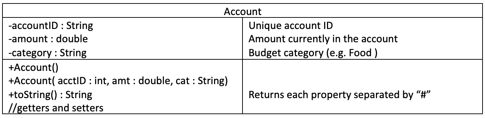

# Lab Exam
## COMP167 Spring 2019

### Introduction

In this problem, you will read in the personal budget information.  A `Budget` is composed of `Account` objects that store spending goals for different budget categories (e.g. rent, food, utilities, phone, etc.).   Create a new JavaFX project named LabFinalExamSpr2019.

### Account Class

The `Account` class stores the data for one budget category.  This class implements the `Comparable` interface and uses the `category` property for comparison.

    - (10%) Implement the `Account` class.  Prove that your class is correct by instantiating an `Account` object in your project `start()` method and outputting the result of the `toString()` method to the console.
