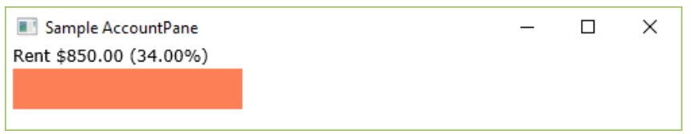

# Lab Exam
## COMP167 Spring 2019

### Introduction

In this problem, you will read in the personal budget information.  A `Budget` is composed of `Account` objects that store spending goals for different budget categories (e.g. rent, food, utilities, phone, etc.).   Create a new JavaFX project named LabFinalExamSpr2019.

### Account Class

The `Account` class stores the data for one budget category.  This class implements the `Comparable` interface and uses the `category` property for comparison.


  - (10%) Implement the `Account` class.  Prove that your class is correct by instantiating an `Account` object in your project `start()` method and outputting the result of the `toString()` method to the console.

### Budget Class

The `Budget` class aggregates a collection of `Account` objects.  It also includes a `description` and a property `totalExpenses` that tracks the budget total.  As you add and remove `Account`s from the `Budget`, you should update the `totalExpenses` property.


#### Input File Format


  - (25%) Implement all the `Budget` class except for the `readBudget(fname : String)` method.  Update your `start()` method to create 5 different `Account`s and add them to a `Budget` object. Call the `toString()` method  to return the contents of the `Budget` and display on the console.
  - (15%) Implement the  `readBudget(fname : String)` method.  Modify the `start()` method so that it populates the `Budget` object using an input file.  Call the `toString()` method  to return the contents of the `Budget` object and  display on the console.

### AccountPane Class

This extended `Pane` class will show a single bar of a bar graph along with the `accountName` (category).   A sample `AccountPane` is displayed in a window below.  The parameters passed to the constructor were  the `category` (“Rent”), the `totalExpenses` for the budget (2500.00) and the `amount` allocated for this “Rent” account (850.00).  The `Text` property is created by concatenating the `accountName` parameter with the `amount` parameter and the percentage created by dividing the `amount` by the `total`.  Use the `String.format()` method to get the `double` values formatted correctly.


#### Sample AccountPane



#### Hints

- Use `%%` to get the percent sign to show up in the formatted `String` value.
- Use the coordinates (5,10) for your `Text` object.
- Use the `setFont()` method to modify the `Text` object, for example:

```
accountInfo.setFont(Font.font("verdana", FontWeight.NORMAL, FontPosture.REGULAR, 12));
```

- Use (5,15) as the coordinates of your `Rectangle` top-left corner.
- The `height` of your `Rectangle` should be 30 pixels, the `width` is calculated by taking `amount`/`total` and multiplying it by the `paneWidth`.

  - (20%) Implement the `AccountPane` class.  Test your class by creating and displaying an `AccountPane` on your `stage` using the constructor parameters: `“Rent”, 2500.00, 850.00, Color.BLUE`.  Your `Scene` parameters should have a `width` of at least 500 pixels.
